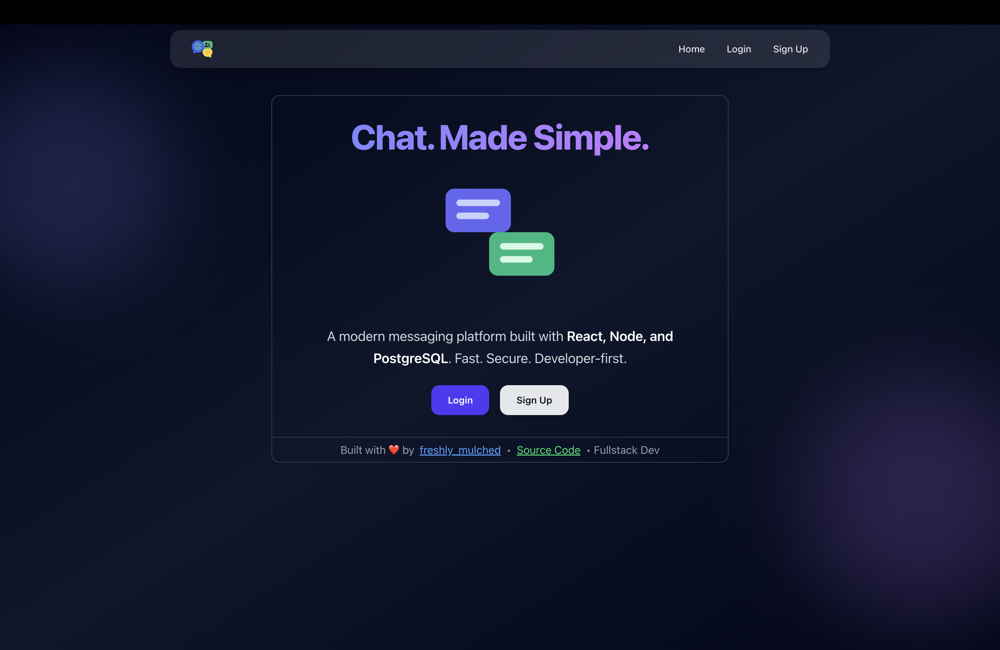
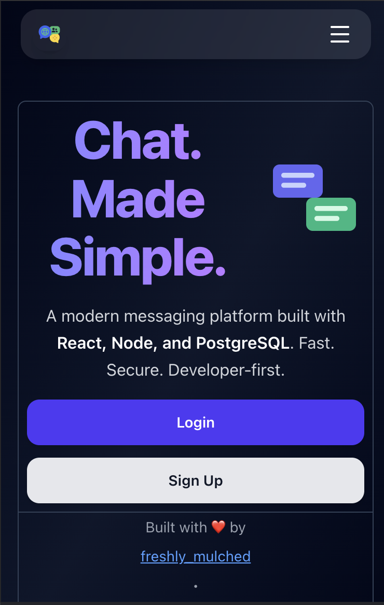
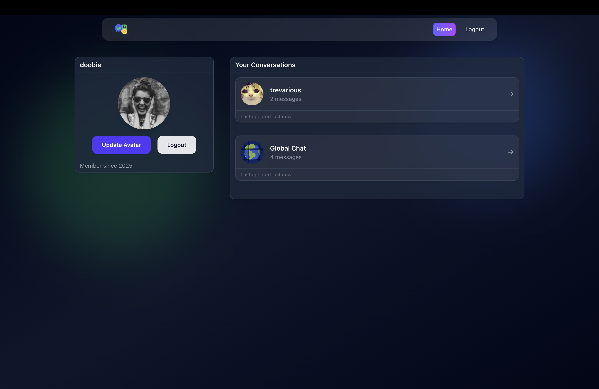
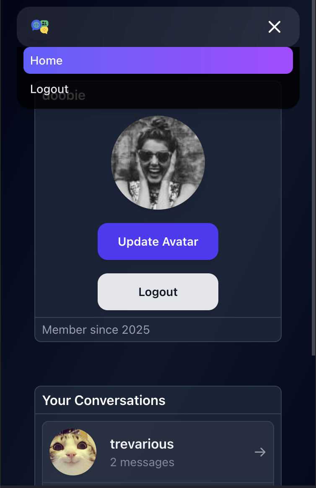

# ChatRooms

A modern, full-stack chat application built with **React**, **Vite**, **TypeScript**, **Express.js**, and **Prisma** using a **PostgreSQL** database. ChatRooms offers a fast, secure, and developer-friendly platform for real-time messaging.

## Screenshots

| **Landing Page (Desktop)** | **Landing Page (Mobile)** |
|----------------------------|---------------------------|
|  |  |

| **Chat Interface** | **Mobile Navigation** |
|--------------------|-----------------------|
|  |  |

## Features

- **Real-time Messaging**: Send and receive messages instantly with a clean, responsive UI.
- **User Authentication**: Secure login and sign-up functionality.
- **Mobile-Friendly**: Optimized for mobile devices with a compact layout and intuitive navigation.
- **Type-Safe Development**: Built with TypeScript for robust type checking and maintainability.
- **Scalable Backend**: Powered by Express.js and Prisma ORM with a PostgreSQL database.
- **Animations**: Smooth UI transitions using Framer Motion.

## Tech Stack

- **Frontend**:
  - React (with TypeScript)
  - Vite (for fast development and builds)
  - Tailwind CSS (for styling)
  - Framer Motion (for animations)
- **Backend**:
  - Express.js (Node.js framework)
  - Prisma ORM (for database interactions)
  - PostgreSQL (database)
- **Other**:
  - Lucide React (for icons)
  - React Router (for navigation)

## Usage

- **Sign Up**: Create an account to start chatting.
- **Login**: Access your account to view conversations.
- **Chat**: Navigate to conversations to send and receive messages in real-time.
- **Responsive Design**: Use on mobile or desktop with a seamless experience.

## Contributing

Contributions are welcome! To contribute:

1. Fork the repository.
2. Create a new branch (`git checkout -b feature/your-feature`).
3. Make your changes and commit (`git commit -m "Add your feature"`).
4. Push to your branch (`git push origin feature/your-feature`).
5. Open a Pull Request.

Please ensure your code follows the project's TypeScript and formatting standards (e.g., Prettier, ESLint).

## License

This project is licensed under the MIT License. See the [LICENSE](LICENSE) file for details.

## Acknowledgments

- Built with ❤️ by [freshly_mulched](https://x.com/freshly_mulched).
- Inspired by modern chat applications and developer-first principles.

## Contact

For questions or feedback, reach out via [GitHub Issues](https://github.com/trev-sykes/ChatRooms/issues) or follow me on [X](https://x.com/freshly_mulched).

---

Happy chatting! 🚀